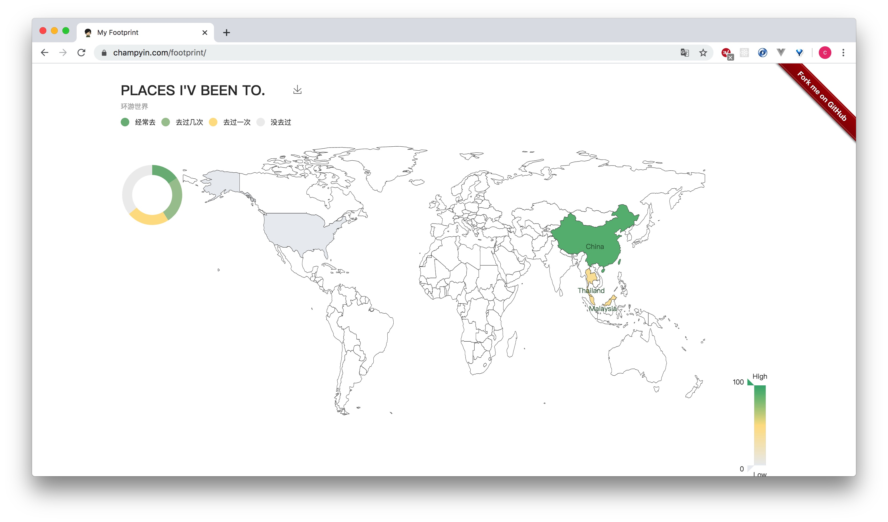

<h1 align="center"> FootPrint </h1>

    
    
    

## 一个可定制的足迹应用
- 根据是否到过以及熟悉程度提供4个等级着色
- 已支持：世界地图、中国地图、美国地图，中国所有省、市地图
- 实现地图下钻上钻
- 支持一键存图

## 使用
1. `fork` 本项目后再 `clone` 到本地
2. 进入项目目录执行 `npm i` 安装依赖
3. 修改 `src/config/place.config.js` 文件，定制你的足迹
4. 执行 `npm start` 预览效果
5. 执行 `npm run build`，即可在 `dist` 目录获取打包文件

主界面预览：
